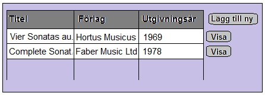
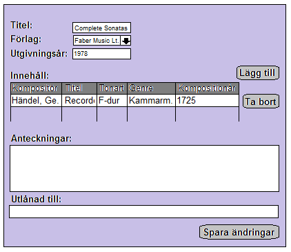

Individuellt arbete - Svante Arvedson

## Problembeskrivning/Idébeskrivning
### Problem
Svante Arvedson arbetar som musiker och har en stor mängd nothäften hemma. 
Det sista året har notsamlingen växt mycket och det nuvarande systemet för 
att administrera samlingen är inte längre dimensionerat för mängden noter, 
med resultatet att Svante har svårt att hålla ordning på nothäftena. En 
databas skulle hjälpa Svante att få bättre koll på sina noter.
### Beskrivning
I databasen ska Svante kunna registrera sina noter. Till ett nothäfte ska 
information om titel, kompositör, genre, instrumentation, huvudtonart, 
kompositionsår och utgivningsår. Även information om vilket notförlag och 
vilken editör som har gett ut noten ska finnas med och det ska finnas en 
möjlighet att skriva anteckningar till varje nothäfte. Det händer ibland 
att Svante lånar ut sina noter, därför ska det också finnas en möjlighet 
att notera vilka noter är utlånade och till vem.
### Begränsning
I det individuellt arbete kommer ett gränssnitt och funktionalitet mot tre 
av tabellerna i databasen att implementeras. Det gäller tabeller för 
nothäften (*Booklet*), för musikstycke (*Piece*) och för innehåll i ett 
nothätfte (*BookletContent*).

## Fysisk datamodell

## Exempeldata
### Piece
<table>
	<tr>
		<th>PieceID</th>
		<th>Name</th>
		<th>CatalogueNumber</th>
		<th>ComposerID</th>
		<th>KeyID</th>
		<th>GenreID</th>
		<th>YearOfComposition</th>
	</tr>
	<tr>
		<td>1</td>
		<td>Blockflöjtssonat</td>
		<td>HWV 369</td>
		<td>2</td>
		<td>6</td>
		<td>3</td>
		<td>1725-01-01 00:00:00</td>
	</tr>
	<tr>
		<td>2</td>
		<td>Blockflöjtssonat</td>
		<td>TWV 41:C5</td>
		<td>3</td>
		<td>5</td>
		<td>3</td>
		<td>1740-01-01 00:00:00</td>
	</tr>
</table>

### Booklet
<table>
	<tr>
		<th>BookletID</th>
		<th>Name</th>
		<th>PublisherID</th>
		<th>YearOfPublication</th>
	</tr>
	<tr>
		<td>3</td>
		<td>Vier Sonaten aus Der getreue Musikmeister</td>
		<td>2</td>
		<td>1969-01-01 00:00:00</td>
	</tr>
	<tr>
		<td>4</td>
		<td>Complete Recorder Sonatas</td>
		<td>3</td>
		<td>1978-01-01 00:00:00</td>
	</tr>
</table>

### BookletContent
<table>
	<tr>
		<th>BookletID</th>
		<th>PieceID</th>
	</tr>
	<tr>
		<td>3</td>
		<td>2</td>
	</tr>
	<tr>
		<td>4</td>
		<td>1</td>
	</tr>
</table>

## Mockup
### Nothäfte, lista
Nothäftena visas i en lista. Möjlighet att välja en post för att visa/redigera 
detaljer och möjlighet att öppna ett formulär för att lägga till en ny post.  

### Nothäfte, detaljvy
Ett nothäftes detaljer visas/redigeras i en seperat vy. Samma utformning används 
för att visa ett nothäfte, redigera ett nothäfte och för att lägga till ett nytt 
nothäfte.  
